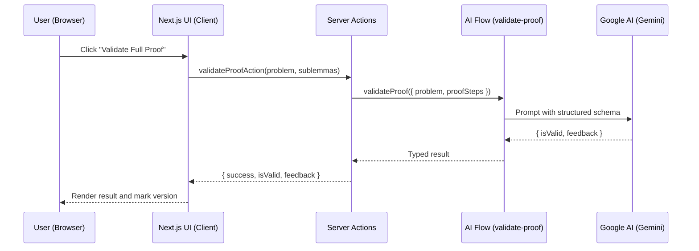

# The Adjoint

The Adjoint is an interactive environment for exploring and building mathematical proofs.  
Instead of tackling a problem all at once, it helps you break it down into smaller pieces, refine each step with AI support, and see how everything fits together. The experience combines structured reasoning, collaboration with AI, and clear visualization to make proof development more approachable and engaging.

## Table of Contents

- [Overview of Features](#overview-of-features)
- [Quick Start](#quick-start)
- [Usage Walkthrough](#usage-walkthrough)
- [Architecture](#architecture)
  - [High-Level Diagram](#high-level-diagram)
  - [Sequence Diagram (Validation Flow)](#sequence-diagram-validation-flow)
  - [Data Contracts](#data-contracts)
  - [Server Flows](#server-flows)
  - [UI Composition](#ui-composition)
  - [Graph Layout and Stability](#graph-layout-and-stability)
  - [Environment and Configuration](#environment-and-configuration)
- [Extensibility and Customization](#extensibility-and-customization)
- [Examples](#examples)
- [Troubleshooting and FAQ](#troubleshooting-and-faq)
- [Contributing](#contributing)

---

## Overview of Features

With The Adjoint, you can move fluidly between exploration, editing, and validation:

- Start with a problem statement, and the system suggests a roadmap of sublemmas that could form a proof.

- Refine and adjust each step directly in the interface, with contextual tools and AI-powered suggestions to guide your revisions.

- Accept or reject proposed changes, while every edit is tracked in a versioned history.

- Validate the entire proof at any time to receive structured feedback on its soundness.

- Switch to a graph view to see how the sublemmas depend on one another, giving you a clear picture of the logical structure.

---

## Quick Start

Before running the application, you should ensure that Node.js 18+ is installed. You will also need an API key for Google AI (Gemini).

1. Create an environment file named `.env.local` in the project root `adjoint/.env.local`. It should contain at least one of the following:
   ```
   GEMINI_API_KEY=your-key-here
   # or
   GOOGLE_API_KEY=your-key-here
   # or
   GOOGLE_GENAI_API_KEY=your-key-here
   ```

2. Install dependencies by running:
   ```
   npm install
   ```

3. Start the development server:
   ```
   npm run dev
   ```
   If the default port is already in use, you can choose another port:
   ```
   npm run dev -- -p 9011
   ```

4. Build a production bundle with:
   ```
   npm run build
   ```
   Then run the server:
   ```
   npm start
   ```
   Production builds are strict and will fail on TypeScript or ESLint errors by design.

---

## Usage Walkthrough

When you open the application, you will be presented with a simple landing page that allows you to enter a problem statement. After you submit your problem, the application calls the “proof decomposition” flow. This flow returns an initial list of sublemmas that form a tentative proof structure.

Each sublemma appears in an accordion so that you can quickly scan and open relevant steps. If you double-click a sublemma, you switch into edit mode and can refine the content. Edits create a new version in the proof history so that you can restore previous states if needed.

In the right-hand panel, you can open an interactive chat. You can ask questions about the proof or ask for changes. In some cases, the AI will return a “Suggested Revision” rather than applying changes immediately. You can accept the suggestion to apply it to the current version or decline it and keep your proof unchanged.

When you are satisfied with the current state, you can validate the entire proof. The application calls a validation flow, which returns a boolean validity flag and detailed feedback. The feedback is rendered using KaTeX for clarity. The validation status is also stored in the active proof version so that you can see which version was validated.

Finally, you can toggle the graph view to visualize how the proof steps depend on one another. The graph is laid out deterministically using Dagre, and positions are stable to avoid flicker when you switch back and forth between the steps and the graph.

---

## Architecture

The Adjoint is structured as a Next.js application (App Router) with server actions that call Genkit-based flows. These flows use Google AI (Gemini) models and return typed results back to the UI.

### High-Level Diagram


The UI renders content and triggers server actions. Server actions call Genkit flows that prepare prompts, enforce schemas, and call Gemini models. Typed results are passed back to the UI to update state and re-render components.

### Sequence Diagram (Validation Flow)



This sequence illustrates how user actions propagate through the system, how server actions delegate to flows, and how results return to the UI.

### Data Contracts

The application consistently uses typed objects to pass content between the UI and flows.

- A “Sublemma” represents a single proof step. It has a `title` and `content` and appears throughout the flows and UI.
- A “ValidationResult” contains an `isValid` boolean and a `feedback` string. The feedback is displayed as KaTeX-rendered text.
- Graph data consists of `nodes` and `edges`. Node labels and references are consistently 1‑based (for example, `step-1`, `step-2`, and `edge-1-2`) to match the way people talk about steps in a proof.

These structures are defined and validated with zod schemas in `src/ai/flows/schemas.ts` and reinforced by TypeScript types throughout the application.

### Server Flows

Server actions are located in `src/app/actions.ts` and act as the entry points for the UI. Each action delegates to a corresponding flow in `src/ai/flows/`.

- Decomposition: `decomposeProblemAction` calls `llm-proof-decomposition.ts` to turn a single problem into a sequence of sublemmas.
- Interactive questioning: `askQuestionAction` triggers `interactive-questioning.ts`, which provides Q&A grounded in the current steps.
- Revision: `reviseOrAskAction` calls `revise-proof.ts`. The flow can apply direct revisions or suggest changes for the user to approve.
- Validation: `validateProofAction` calls `validate-proof.ts` to determine validity and generate feedback. There is also a `validate-statement.ts` for single statements.
- Autoformalization: `autoformalizeAction` calls `autoformalize.ts` to formalize and attempt a proof of a single lemma.
- Graph generation: `generateProofGraphAction` calls `generate-proof-graph.ts` to produce a dependency graph of nodes and edges.

All flows run on the server. They use Genkit’s Google AI plugin (`@genkit-ai/googleai`) via `src/ai/genkit.ts`, which configures the default model (`googleai/gemini-2.5-flash`) and allows swapping or reconfiguring models if needed.

### UI Composition

The UI is organized into pages and composable components.

- The landing page (`src/app/page.tsx`) is the entry point where you provide a problem statement.
- The main workspace (`src/app/proof/page.tsx`) hosts `ProofDisplay`, which orchestrates the steps view, validation controls, history, and graph toggle.
- The `SublemmaItem` component (`src/components/sublemma-item.tsx`) renders an individual step, handles edit mode, and shows a selection-aware toolbar for localized revisions.
- The `InteractiveChat` component (`src/components/interactive-chat.tsx`) manages the chat thread and suggested revisions and can trigger proof updates when suggestions are accepted.
- The graph renderer (`src/components/proof-graph.tsx`) and Dagre layout (`src/components/dagre-layout.tsx`) visualize dependencies with stable positions.
- The `ProofHistorySidebar` component (`src/components/proof-history-sidebar.tsx`) lets you browse and restore older versions.
- The `KatexRenderer` component (`src/components/katex-renderer.tsx`) renders KaTeX inline and display math with error highlighting and sensible text sanitization.

### Graph Layout and Stability

The graph layout uses Dagre to compute node positions. Each layout run constructs a new Dagre graph in memory and returns new node objects with positions. This approach avoids mutating existing nodes and prevents flicker when you toggle views or update the proof.

All user-facing labels and references in the graph use 1‑based indexing. This convention matches human labeling and reduces off‑by‑one confusion when interpreting AI outputs.

### Environment and Configuration

Environment validation is centralized in `src/env.ts` using zod. The application requires that at least one of `GEMINI_API_KEY`, `GOOGLE_API_KEY`, or `GOOGLE_GENAI_API_KEY` be present. The `src/ai/genkit.ts` module imports this validation so the server fails fast if keys are missing.

Next.js build settings are structured so that development can be more permissive, while production builds are strict and fail on type or lint errors. This configuration ensures that you do not accidentally deploy an invalid or poorly typed version.

KaTeX styles are imported globally from `src/app/globals.css` (and optionally via a CDN link in `src/app/layout.tsx`) so that the MathML fallback remains accessible but not visually duplicated.

---

## Extensibility and Customization

You can customize the default Gemini model by editing `src/ai/genkit.ts`. The application uses Genkit’s model references, which support configuration for settings such as temperature and safety. If you need a different flow, you can create a new module in `src/ai/flows/` and expose it through a new server action in `src/app/actions.ts`. The UI can then call the new action from a button, menu, or chat command.

If you need to enrich the graph, you can add metadata to nodes and edges and extend `src/components/proof-graph.tsx` to reflect those changes in the visual style. The layout function in `src/components/dagre-layout.tsx` can be adapted to place nodes by rank, category, or other properties.

Because the system uses zod for schemas and TypeScript for types, it is straightforward to maintain type safety as you extend the application.
