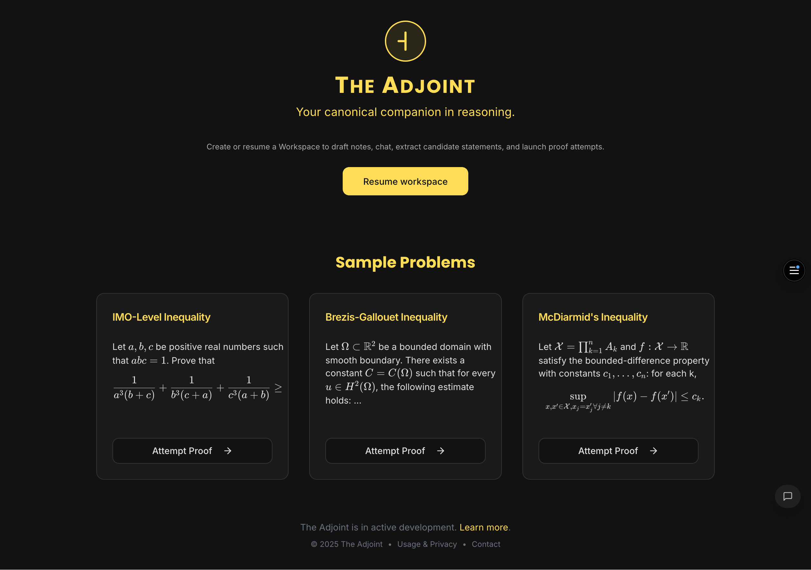
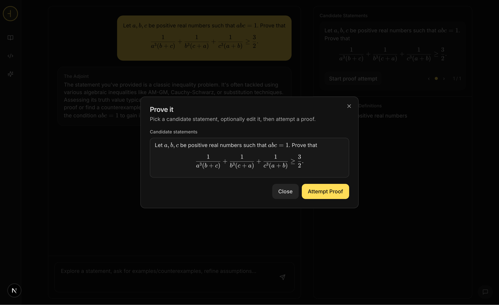
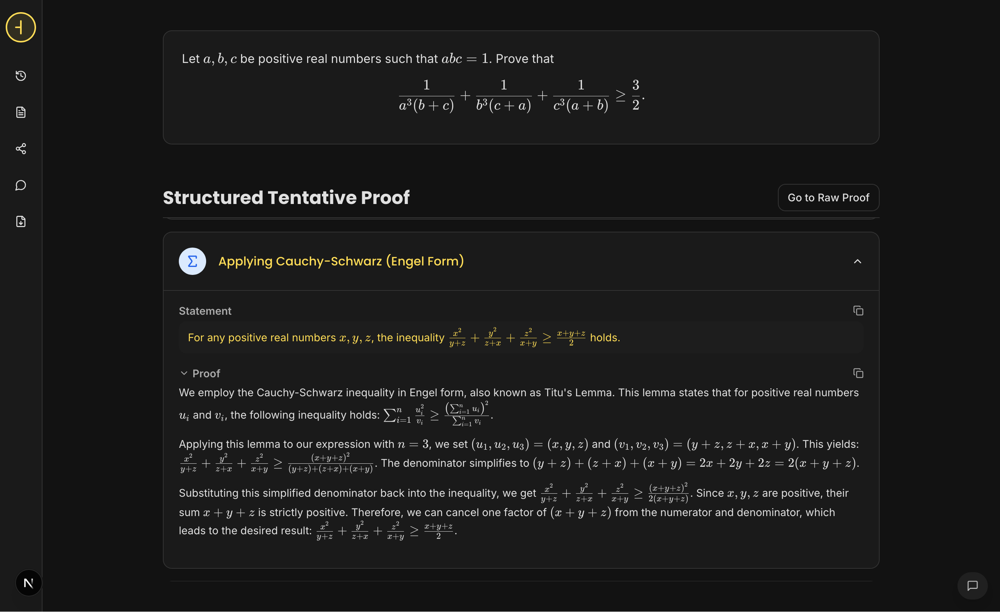
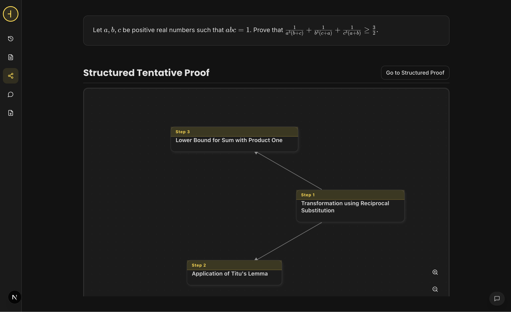
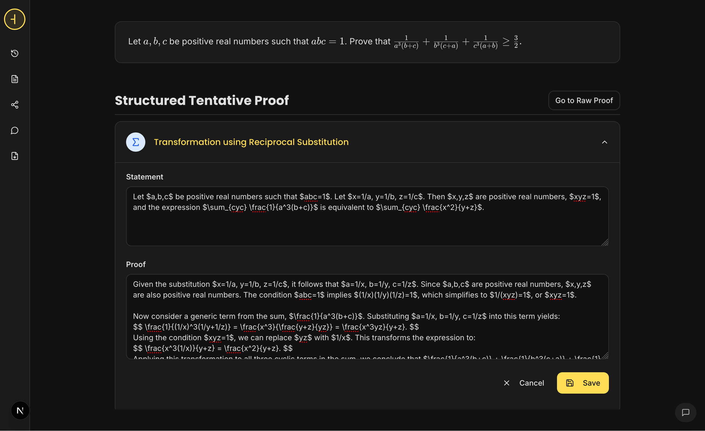
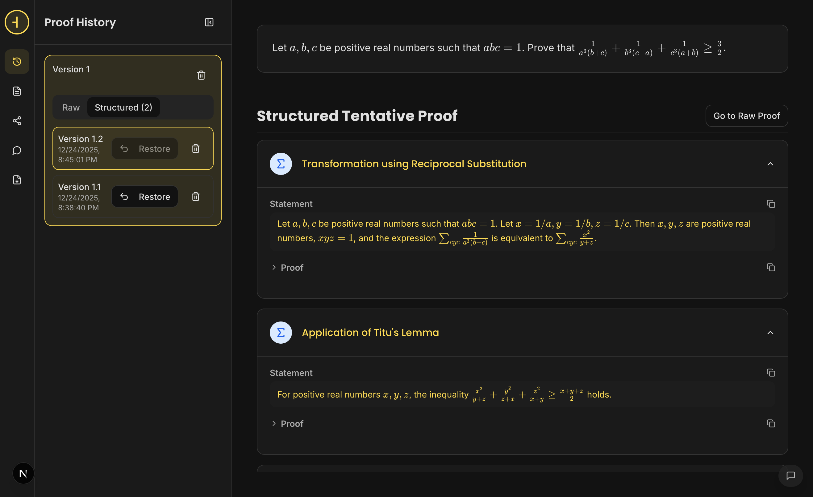
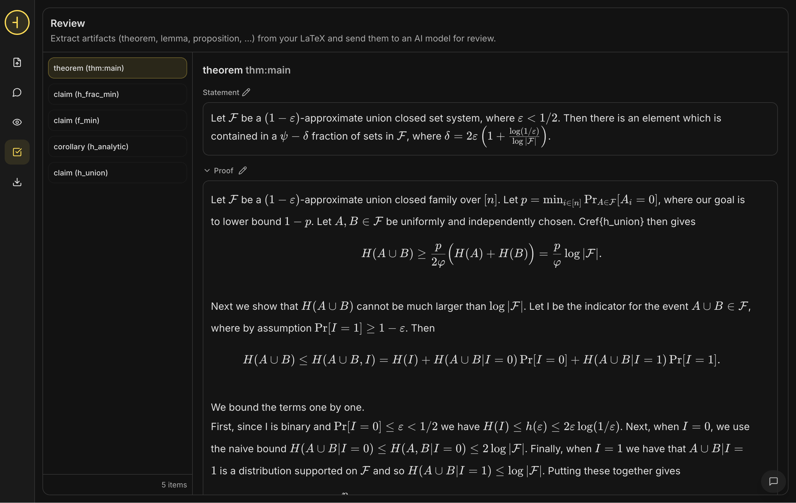
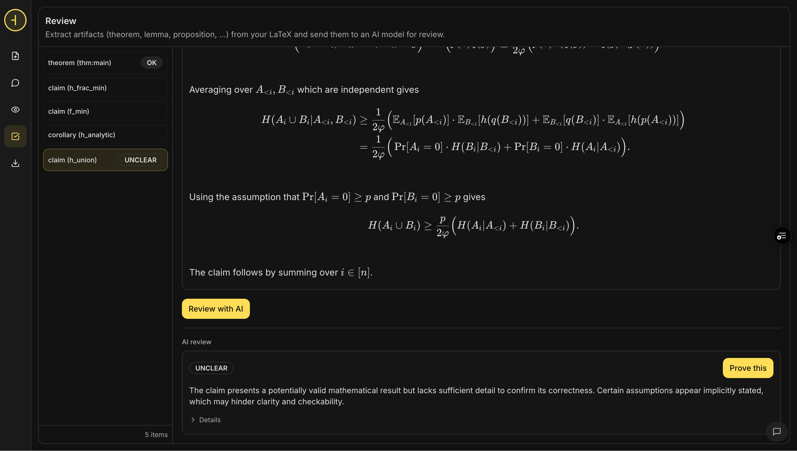

# The Adjoint

The Adjoint is an interactive environment for **exploring** and **building** mathematical proofs together with state-of-the-art AI models. The goal is to streamline collaboration with LLMs to prove mathematical statements.

It’s built around a simple workflow:

1. **Explore**: to turn a problem or a question into candidate statements together with their assumptions.
2. **Prove**: to transform a first proof into a structured proof, decomposed into smaller lemmas, that you can easily iterate on.
3. **Write**: to write and iterate on mathematical notes, check and review statements. 


---

## The Main Features

### Explore mode to formulate the best statement

Chat to refine the problem and context


The Adjoint will automatically extract **candidate statements**, **assumptions**, and other artifacts. You can always directly edit artifacts and **promote a candidate statement** to “Prove”.


### Prove mode to structure and iterate on proof construction

Structure the initial AI-suggested proof into a proof structured in **sublemmas**.


Switch to a **dependency graph** view to understand how steps connect.


Ask for edits in chat or directly edit the proposed proof.


Keep a **version history** so you can revisit earlier attempts.


And last but not least, **Export to LaTeX** (`proof.tex`).

### Workspace mode to write and review mathematical notes

Write a mathematical document with direct in-context actions (chat, prove, review,...)


Review notes artifacts (lemmas, propositions, theorems,...). Those are automatically extracted through a regex heuristic if in proper LaTeX environment.


Check artifact consistency and send to the prover mode if needed.


## Quick start

### Prerequisites

- Node.js **18+**

### Install

```bash
cd adjoint
npm install
```

### Configure an LLM provider

Create `adjoint/.env.local` where you should specify either Gemini or OpenAI API keys. 

**Google (Gemini)**

```bash
LLM_PROVIDER=googleai
GEMINI_API_KEY=your-key
```

**OpenAI**

```bash
LLM_PROVIDER=openai
OPENAI_API_KEY=your-key
```

### Run

```bash
npm run dev
```

Then open the Adjoint at **http://localhost:9002** (or whatever port you configured).

---

## Future Directions

There is still a lot of work to do. From better prompts for all internal AI models to validation with either symbolic engines (like Sympy) and formal engines (like Lean or Rocq) or literature exploration...  


## Contributing

Issues and pull requests are welcome.

If you’re planning a substantial change, please open an issue first so we can discuss direction.

---

## License

MIT — see [LICENSE](LICENSE).
