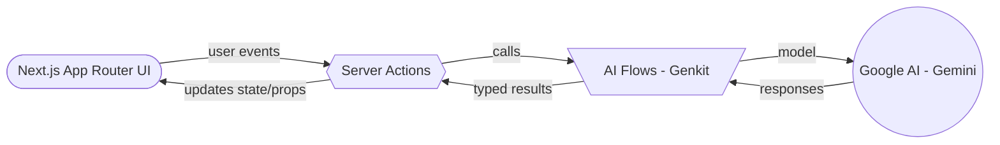
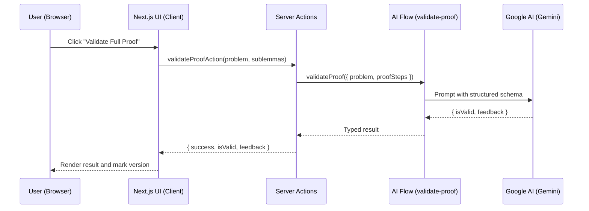
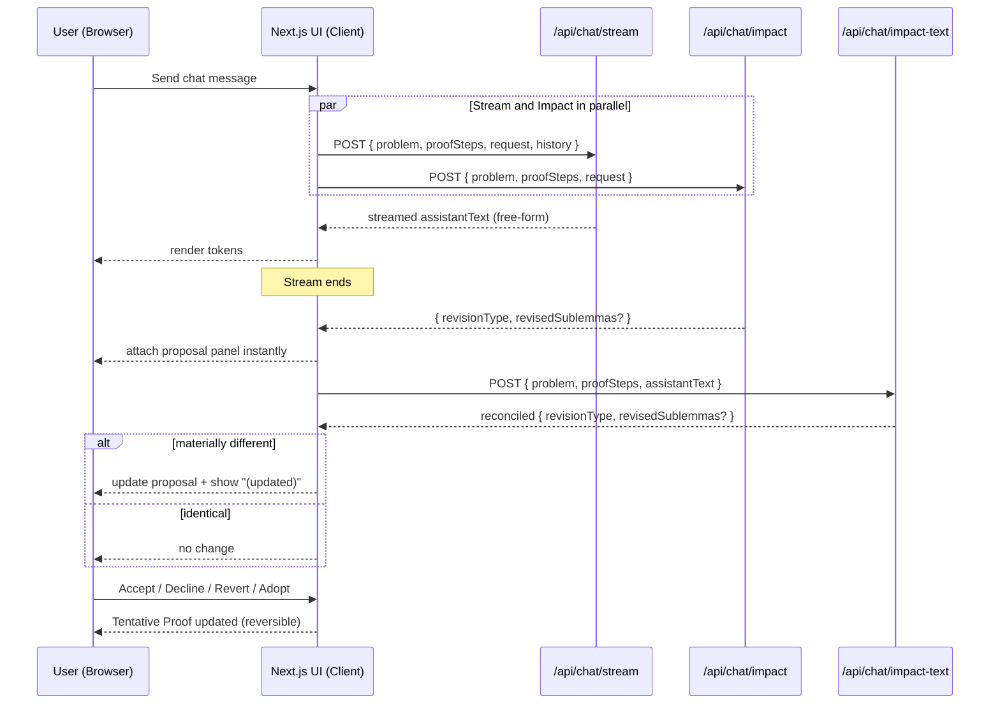

# The Adjoint

The Adjoint is an interactive environment for exploring and building mathematical proofs.  
Instead of tackling a problem all at once, it helps you break it down into smaller pieces, refine each step with AI support, and see how everything fits together. The experience combines structured reasoning, collaboration with AI, and clear visualization to make proof development more approachable and engaging.

## Table of Contents

- [Overview of Features](#overview-of-features)
- [Quick Start](#quick-start)
- [Usage Walkthrough](#usage-walkthrough)
- [AI Chat: Streaming, Impact, Reconciliation, and Reversible Actions](#ai-chat-streaming-impact-reconciliation-and-reversible-actions)
  - [What the user sees](#what-the-user-sees)
  - [How it works under the hood](#how-it-works-under-the-hood)
  - [Endpoints](#endpoints)
  - [Copy and UI labels](#copy-and-ui-labels)
  - [Notes on performance and quality](#notes-on-performance-and-quality)
- [Architecture](#architecture)
  - [High-Level Diagram](#high-level-diagram)
  - [Sequence Diagram (Validation Flow)](#sequence-diagram-validation-flow)
  - [Sequence Diagram (Chat Flow)](#sequence-diagram-chat-flow)
  - [Data Contracts](#data-contracts)
  - [Server Flows](#server-flows)
  - [UI Composition](#ui-composition)
  - [Graph Layout and Stability](#graph-layout-and-stability)
  - [Environment and Configuration](#environment-and-configuration)
- [Extensibility and Customization](#extensibility-and-customization)
- [Examples](#examples)
- [Troubleshooting and FAQ](#troubleshooting-and-faq)
- [Contributing](#contributing)

---

## Overview of Features

With The Adjoint, you can move fluidly between exploration, editing, and validation:

- Start with a problem statement, and the system suggests a roadmap of sublemmas that could form a proof.

- Refine and adjust each step directly in the interface, with contextual tools and AI-powered suggestions to guide your revisions.

- Accept or reject proposed changes, while every edit is tracked in a versioned history.

- Validate the entire proof at any time to receive structured feedback on its soundness.

- Switch to a graph view to see how the sublemmas depend on one another, giving you a clear picture of the logical structure.

---

## Quick Start

Before running the application, you should ensure that Node.js 18+ is installed. Choose an LLM provider via environment variables.

1. Create an environment file named `.env.local` in the project root `adjoint/.env.local`. Example configurations:

   Google (default):

   ```
   LLM_PROVIDER=googleai
   # optional: override default model
   # LLM_MODEL=gemini-2.5-flash
   GEMINI_API_KEY=your-key-here
   # or
   GOOGLE_API_KEY=your-key-here
   # or
   GOOGLE_GENAI_API_KEY=your-key-here
   ```

   OpenAI:

   ```
   LLM_PROVIDER=openai
   # optional: override default model
   # LLM_MODEL=gpt-5-mini
   OPENAI_API_KEY=your-openai-key
   ```

2. Install dependencies by running:

   ```
   npm install
   ```

3. Start the development server:

   ```
   npm run dev
   ```

   If the default port is already in use, you can choose another port:

   ```
   npm run dev -- -p 9011
   ```

4. Build a production bundle with:
   ```
   npm run build
   ```
   Then run the server:
   ```
   npm start
   ```
   Production builds are strict and will fail on TypeScript or ESLint errors by design.

---

## Usage Walkthrough

When you open the application, you will be presented with a simple landing page that allows you to enter a problem statement. After you submit your problem, the application calls the “proof decomposition” flow. This flow returns an initial list of sublemmas that form a tentative proof structure.

Each sublemma appears in an accordion so that you can quickly scan and open relevant steps. If you double-click a sublemma, you switch into edit mode and can refine the content. Edits create a new version in the proof history so that you can restore previous states if needed.

In the right-hand panel, you can open an interactive chat. You can ask questions about the proof or ask for changes. In some cases, the AI will return a “Suggested Revision” rather than applying changes immediately. You can accept the suggestion to apply it to the current version or decline it and keep your proof unchanged.

When you are satisfied with the current state, you can validate the entire proof. The application calls a validation flow, which returns a boolean validity flag and detailed feedback. The feedback is rendered using KaTeX for clarity. The validation status is also stored in the active proof version so that you can see which version was validated.

Finally, you can toggle the graph view to visualize how the proof steps depend on one another. The graph is laid out deterministically using Dagre, and positions are stable to avoid flicker when you switch back and forth between the steps and the graph.

---

## AI Chat: Streaming, Impact, Reconciliation, and Reversible Actions

The AI chat provides live token streaming and a structured “proposal” workflow to keep proof changes explicit and user‑controlled.

### What the user sees

- Live streaming answer: the assistant types in real time.
- At the moment streaming finishes, a proposal panel appears under the message:
  - “Proposed proof changes (preview)” showing the revised sublemmas.
  - Controls:
    - Accept proposed changes
    - Decline
- If accepted: the message shows “Accepted by user.” and a Revert changes button.
- If declined: the message shows “Declined.” and an Adopt proposal button to apply it later.
- If reverted: the message shows “Reverted to previous version.” and an Adopt proposal button to re-apply.

Notes:

- The assistant never claims changes have already been applied. It uses proposal phrasing.
- On rare occasions the proposal may update right after rendering with a subtle “(updated)” indicator—this aligns the proposal precisely with the assistant’s final wording.

### How it works under the hood

- Streaming (/api/chat/stream): Free-form assistant text is streamed without enforcing a strict schema (better readability).
- Parallel impact (no gap): While streaming is ongoing, the app runs an “impact” request in parallel that analyzes the user’s request against the current proof to determine:
  - revisionType = DIRECT_REVISION | SUGGESTED_REVISION | NO_REVISION | OFF_TOPIC
  - revisedSublemmas (if proposing changes)
- Instant attach at stream end: As soon as streaming ends, the impact result is attached (no visible delay).
- Reconciliation with exact wording: Immediately after stream end, a second fast call derives the proposal from the final assistant text. If this result materially differs from the initial impact, the panel is updated and marked “(updated)”.

### Endpoints

- POST `/api/chat/stream`  
  Streams assistant text for the current turn.

- POST `/api/chat/impact`  
  Input: `{ problem, proofSteps, request }`  
  Output: `{ revisionType, revisedSublemmas? }`  
  Runs in parallel with streaming, using the current proof context for accurate proposals.

- POST `/api/chat/impact-text`  
  Input: `{ problem, proofSteps, assistantText }`  
  Output: `{ revisionType, revisedSublemmas? }`  
  Derives the proposal from the assistant’s final text to keep the panel aligned with exact wording.

### Copy and UI labels

- Proposal controls:
  - Accept proposed changes
  - Decline
- After accepted:
  - Banner: Accepted by user.
  - Action: Revert changes
- After declined:
  - Banner: Declined.
  - Action: Adopt proposal
- After reverted:
  - Banner: Reverted to previous version.
  - Action: Adopt proposal
- Streaming state: no text labels; only subtle skeleton bars are shown.

### Notes on performance and quality

- No visible gap between stream end and proposal panel.
- Proposals are grounded in the current proof (for correct merges/splits/inserts).
- Reconciliation step ensures alignment with the assistant’s exact wording.
- All actions are reversible; the preview remains visible for transparency.

---

## Architecture

The Adjoint is structured as a Next.js application (App Router) with server actions that call Genkit-based flows. These flows use Google AI (Gemini) models and return typed results back to the UI.

### High-Level Diagram



The UI renders content and triggers server actions. Server actions call Genkit flows that prepare prompts, enforce schemas, and call Gemini models. Typed results are passed back to the UI to update state and re-render components.

### Sequence Diagram (Validation Flow)



### Sequence Diagram (Chat Flow)



### Data Contracts

The application consistently uses typed objects to pass content between the UI and flows.

- Sublemma: `{ title: string; statement: string; proof: string }` — structured lemma with separate Statement and Proof sections.
- ValidationResult: `{ isValid: boolean; feedback: string }` — rendered with KaTeX.
- Chat message (client state):
  - `Message = { role: 'user' | 'assistant'; content: string; ... }`
  - Suggestion state (if present):  
    `{ revisedSublemmas: Sublemma[]; prevSublemmas?: Sublemma[]; isHandled: boolean; status?: 'accepted' | 'declined' | 'reverted'; updated?: boolean }`
    - `prevSublemmas` enables Revert.
    - `updated` indicates the proposal was reconciled to match assistant text.

These structures are defined and validated with zod where appropriate (server flows) and reinforced by TypeScript types throughout the application.

### Server Flows

Server actions are located in `src/app/actions.ts` and act as the entry points for the UI. Each action delegates to a corresponding flow in `src/ai/flows/`.

- Decomposition: `decomposeProblemAction` calls `llm-proof-decomposition.ts` to turn a single problem into a sequence of sublemmas.
- Interactive questioning: `askQuestionAction` triggers `interactive-questioning.ts`, which provides Q&A grounded in the current steps.
- Revision: `reviseProof.ts` powers both the “impact” proposal (`/api/chat/impact`) and the “assistant-text reconciliation” (`/api/chat/impact-text`), driving DIRECT/SUGGESTED/NO_REVISION/OFF_TOPIC and revisedSublemmas.
- Validation: `validateProofAction` calls `validate-proof.ts` to determine validity and generate feedback. There is also a `validate-statement.ts` for single statements.
- Graph generation: `generate-proof-graph.ts` produces a dependency graph of nodes and edges.

All flows run on the server. They call a provider-selected AI client via `src/ai/genkit.ts`:

- Google path: uses Genkit with `@genkit-ai/googleai`, default model `googleai/gemini-2.5-flash`.
- OpenAI path: uses a lightweight shim around the OpenAI SDK that mimics Genkit’s `definePrompt`/`defineFlow` surface (no changes needed in flow code).

Switch providers by setting `LLM_PROVIDER` (and optionally `LLM_MODEL`) in `.env.local`.

### UI Composition

The UI is organized into pages and composable components.

- The landing page (`src/app/page.tsx`) is the entry point where you provide a problem statement.
- The main workspace (`src/app/proof/page.tsx`) hosts `ProofDisplay`, which orchestrates the steps view, validation controls, history, and graph toggle.
- The `SublemmaItem` component (`src/components/sublemma-item.tsx`) renders an individual step, handles edit mode, and shows a selection-aware toolbar for localized revisions.
- The `InteractiveChat` component (`src/components/interactive-chat.tsx`) manages the chat thread, proposals, and reversible actions; it streams assistant text and attaches proposals with impact + reconciliation.
- The graph renderer (`src/components/proof-graph.tsx`) and Dagre layout (`src/components/dagre-layout.tsx`) visualize dependencies with stable positions.
- The `ProofHistorySidebar` component (`src/components/proof-history-sidebar.tsx`) lets you browse and restore older versions.
- The `KatexRenderer` component (`src/components/katex-renderer.tsx`) renders KaTeX inline and display math with error highlighting and sensible text sanitization.

### Graph Layout and Stability

The graph layout uses Dagre to compute node positions. Each layout run constructs a new Dagre graph in memory and returns new node objects with positions. This approach avoids mutating existing nodes and prevents flicker when you toggle views or update the proof.

All user-facing labels and references in the graph use 1‑based indexing. This convention matches human labeling and reduces off‑by‑one confusion when interpreting AI outputs.

### Environment and Configuration

Environment validation is centralized in `src/env.ts` using zod. It is provider-aware:

- If `LLM_PROVIDER=googleai` (default), one of `GEMINI_API_KEY`, `GOOGLE_API_KEY`, or `GOOGLE_GENAI_API_KEY` is required.
- If `LLM_PROVIDER=openai`, `OPENAI_API_KEY` is required.

`src/ai/genkit.ts` imports this validation so the server fails fast if keys are missing.

Next.js build settings are structured so that development can be more permissive, while production builds are strict and fail on type or lint errors. This configuration ensures that you do not accidentally deploy an invalid or poorly typed version.

KaTeX styles are imported globally from `src/app/globals.css` (and optionally via a CDN link in `src/app/layout.tsx`) so that the MathML fallback remains accessible but not visually duplicated.

---

## Extensibility and Customization

You can customize the default Gemini model by editing `src/ai/genkit.ts`. The application uses Genkit’s model references, which support configuration for settings such as temperature and safety. If you need a different flow, you can create a new module in `src/ai/flows/` and expose it through a new server action in `src/app/actions.ts`. The UI can then call the new action from a button, menu, or chat command.

If you need to enrich the graph, you can add metadata to nodes and edges and extend `src/components/proof-graph.tsx` to reflect those changes in the visual style. The layout function in `src/components/dagre-layout.tsx` can be adapted to place nodes by rank, category, or other properties.

Because the system uses zod for schemas and TypeScript for types, it is straightforward to maintain type safety as you extend the application.

---

## Troubleshooting and FAQ

- I don’t see the proposal panel right away after an answer finishes streaming.
  - The app runs an impact analysis in parallel with streaming and attaches the panel instantly at stream end. If you still see a delay, ensure your API key is set correctly and that your network isn’t throttling API calls.

- The proposal changed and shows “(updated)”.
  - That indicates the server reconciled the proposal to match the assistant’s exact final wording. Functionality is the same, the update is just a refinement for consistency.

- Can I undo a proposal I accepted?
  - Yes. Click “Revert changes”. You can also “Adopt proposal” later if you previously declined or reverted.

- What models are used?
  - The default model is `googleai/gemini-2.5-flash`. You can modify this in `src/ai/genkit.ts`. The chat stream uses direct streaming; proposals come from typed flows.
  - When `LLM_PROVIDER=openai`, the default model is `gpt-5-mini` (override with `LLM_MODEL` if desired).

- Port already in use?
  - Start dev with a different port, e.g. `npm run dev -- -p 9011`.
